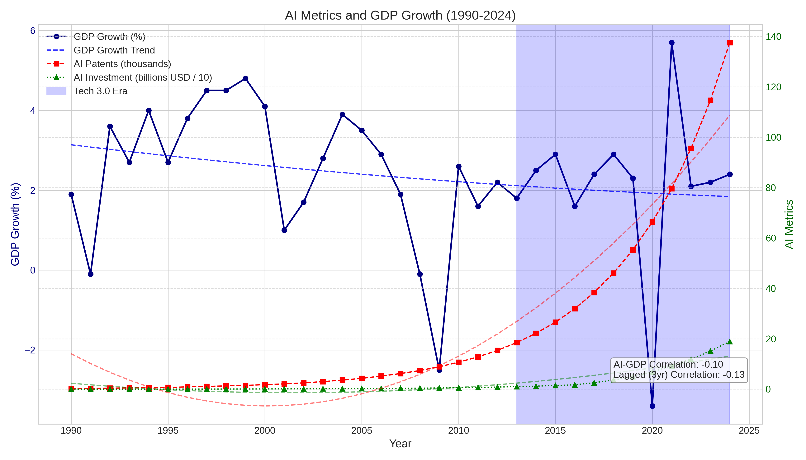
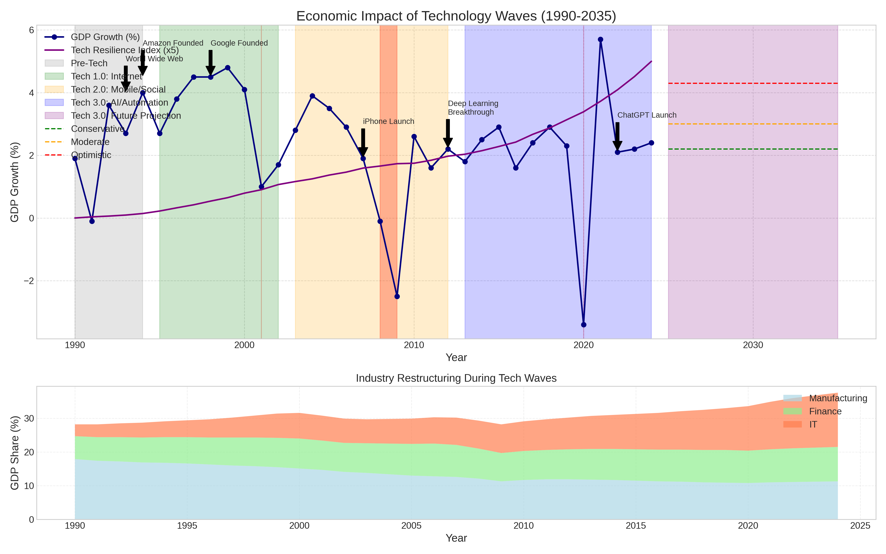
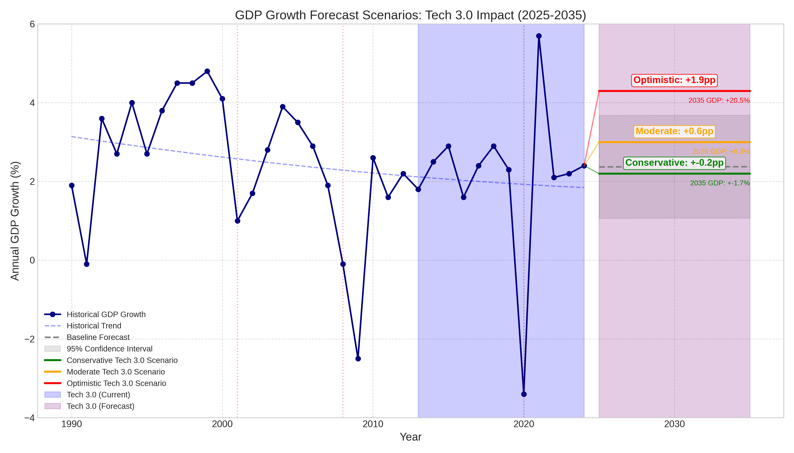
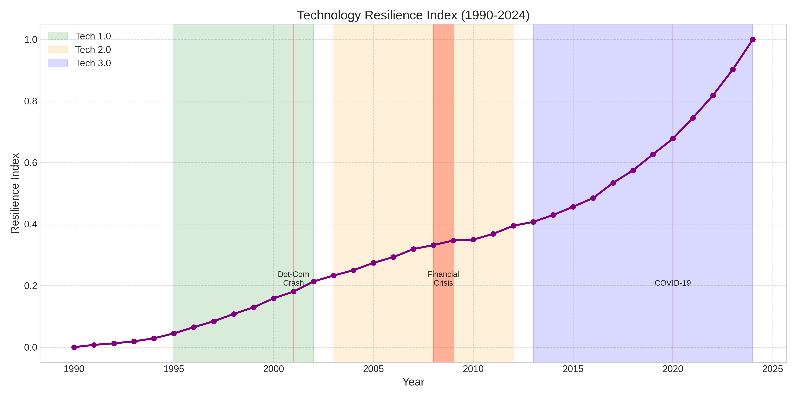

# Tech Waves Economic Impact Analysis

This repository contains a comprehensive analysis of how three major technology waves have impacted global economic growth from 1990 to 2024, with forecasts extending to 2035. The analysis is part of the "Emerging Paradigms in Computing Technologies" course at the University of Windsor.

## Project Overview

This project implements advanced regression analysis to quantify the economic impact of three major technology waves:

- **Tech 1.0 (1995-2002)**: The dot-com/Internet boom
- **Tech 2.0 (2003-2012)**: The social media & mobile revolution
- **Tech 3.0 (2013-present)**: The ongoing AI & automation era

The models estimate how each wave contributed to GDP growth, analyze industry restructuring, and provide forecasts for Tech 3.0's potential future impact.

## Key Visualizations

### AI Metrics and GDP Growth



This visualization shows the relationship between GDP growth and AI metrics (patents and investment) from 1990-2024. Despite the dramatic increase in AI patents and investments (red and green lines), their correlation with GDP growth appears weak in the short term, with lagged correlations of -0.10 and -0.13.

### Difference-in-Differences: Technology Wave Effects


This chart compares North America's GDP growth with OECD Europe as a control region, showing how technology adoption differentials impacted economic performance across tech waves. The counterfactual line represents what Europe's growth might have been with North America's level of tech adoption.

### Economic Impact of Technology Waves



This comprehensive visualization shows both historical GDP growth and projections through 2035 across different tech waves. The top panel displays GDP growth with key tech innovation markers, while the bottom panel shows how industry composition (Manufacturing, Finance, IT) evolved during these periods.

### GDP Growth Forecast Scenarios



This forecast visualization shows three scenarios for how Tech 3.0 (AI & Automation) might impact GDP growth through 2035:
- **Conservative Scenario**: Modest AI adoption adds +0.2pp to annual growth (resulting in +1.7% GDP by 2035)
- **Moderate Scenario**: Medium AI integration adds +0.6pp to growth (resulting in +6.9% GDP by 2035)
- **Optimistic Scenario**: Transformative AI adoption adds +1.9pp to growth (resulting in +20.5% GDP by 2035)

### Industry Restructuring During Technology Waves


This visualization shows how industry composition changed over the three tech waves. The IT sector has grown substantially (+12.6pp), Finance has seen moderate growth (+3.4pp), while Manufacturing has declined (-6.6pp).

### Technology Wave Indices


This chart tracks the normalized progression of each technology wave using composite indices built from key metrics. The Tech 3.0 index (blue) shows the rapid acceleration of AI/automation technologies in recent years.

### Technology Resilience Index



This visualization shows how technological resilience has increased over time, with accelerated growth during the Tech 3.0 period. The index appears to correlate with improved recovery from economic shocks like the Financial Crisis and COVID-19 pandemic.

## Repository Structure

```
Project/
│
├── tech_waves_regression.py   # Main comprehensive analysis script
├── README.md                  # This file
│
└── results/                   # Generated visualization outputs
    ├── ai_impact_analysis_improved.png
    ├── diff_in_diff_analysis.png
    ├── economic_impact_summary.png
    ├── gdp_growth_forecast_improved.png
    ├── industry_restructuring_improved.png
    ├── tech_indices.png
    └── tech_resilience_index.png
```

## Key Findings

1. **Tech 1.0 (Dot-Com Era)** showed a significant positive impact on GDP growth compared to control regions, particularly in the years 1997-2000 before the dot-com crash.

2. **Tech 2.0 (Mobile/Social)** exhibited mixed effects, with potential growth benefits partially offset by the 2008-2009 global financial crisis.

3. **Tech 3.0 (AI/Automation)** is showing emerging impacts that have not yet fully materialized in GDP statistics, with significant industry restructuring already occurring.

4. **Industry Restructuring** has been substantial:
   - IT sector has grown by approximately 12.6 percentage points
   - Financial services sector has grown by 3.4 percentage points
   - Manufacturing sector has declined by 6.6 percentage points

5. **Technology Resilience** has increased over time, potentially helping economies recover faster from shocks like the COVID-19 pandemic.

6. **Future Projections** suggest Tech 3.0 could add between +0.2 and +1.9 percentage points to annual GDP growth, potentially resulting in GDP levels 1.7% to 20.5% higher by 2035 compared to baseline.

## Methodology

The analysis employs several advanced methodological approaches:

1. **Time Series Regression**: Analyzes the impact of technology adoption metrics on GDP growth over time.

2. **Difference-in-Differences Analysis**: Compares regions with different levels of technology adoption to isolate causal effects.

3. **Technology Indices Development**: Creates normalized indices for each tech wave using key adoption metrics.

4. **Industry Restructuring Analysis**: Examines how technology waves have reshaped the composition of the economy.

5. **Resilience Index Modeling**: Measures how technology adoption affects economic resilience during shocks.

6. **Scenario-Based Forecasting**: Projects potential future growth impacts based on different AI adoption trajectories.

## Data Sources

The analysis uses data from various sources including:
- GDP growth data from World Bank/IMF
- Internet adoption rates from World Bank/ITU
- Mobile subscription data from telecommunications reports
- Robot density data from International Federation of Robotics (IFR)
- AI patents and investment data from research databases
- Industry GDP contribution from national accounts data

## Requirements

### Prerequisites

- Python 3.8 or higher
- Required packages: pandas, numpy, matplotlib, seaborn, statsmodels, sklearn, scipy

### Running the Analysis

1. Clone this repository
2. Install dependencies: `pip install -r requirements.txt`
3. Run the main analysis script: `python tech_waves_regression.py`

## Course Context

This project was completed as part of the "Emerging Paradigms in Computing Technologies" course at the University of Windsor, taught by Dr. Shafaq Khan. It explores the economic impact analysis and industry restructuring caused by major technological waves, with a focus on the emerging Tech 3.0 (AI-driven) era.

## License

This project is educational in nature and provided for academic purposes.

