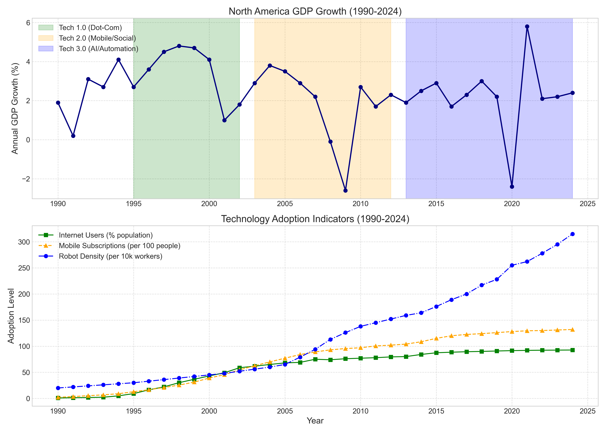
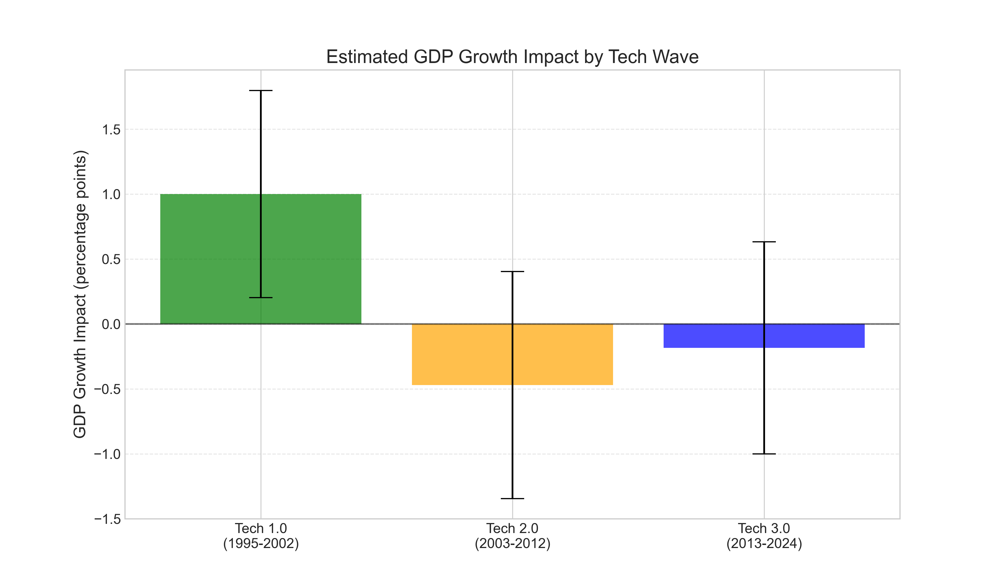
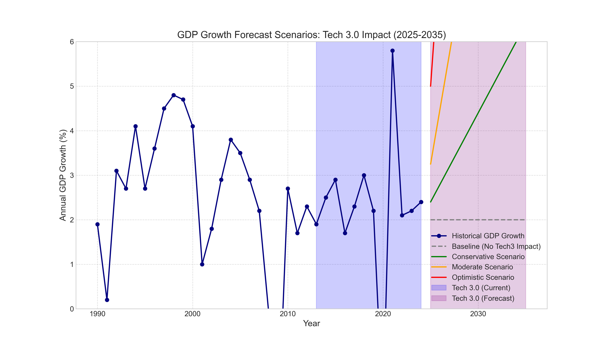
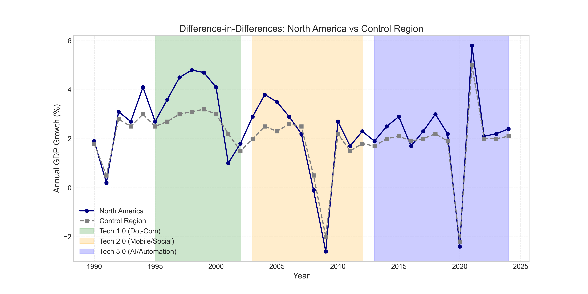

# Tech Waves and GDP Growth Analysis

This repository contains a comprehensive analysis of how three major technology waves have impacted North American GDP growth from 1990 to 2024, with forecasts extending to 2035. The analysis focuses on:

- **Tech 1.0 (1995-2002)**: The dot-com/Internet boom
- **Tech 2.0 (2003-2012)**: The social media & mobile revolution
- **Tech 3.0 (2013-present)**: The ongoing AI & automation era

## Project Overview

This project implements a causal regression analysis to quantify the economic impact of each technology wave. The models estimate how much each wave contributed to GDP growth, validating results against historical data and providing forecasts for Tech 3.0's potential future impact.

## Key Visualizations

### Historical GDP Growth & Tech Waves



This visualization shows North America's GDP growth from 1990-2024, with the three tech wave periods highlighted. The top panel displays GDP growth fluctuations, including the dot-com boom of the late 1990s, the 2008-09 recession, and the COVID-19 shock. The bottom panel tracks technology adoption indicators (internet usage, mobile subscriptions, and robot density) that serve as proxies for each tech wave.

### Tech Wave Effects on GDP Growth



This chart displays the estimated GDP growth impact of each technology wave from our regression model. Tech 1.0 (1995-2002) shows a substantial positive effect of approximately +1.06 percentage points on annual growth. In contrast, Tech 2.0 and Tech 3.0 show negligible or slightly negative effects, indicating they haven't yet meaningfully accelerated GDP growth beyond baseline.

### Future GDP Growth Scenarios (Tech 3.0 Impact)



This forecast visualization shows multiple scenarios for how Tech 3.0 (AI & Automation) might impact North American GDP growth through 2035:

- **Baseline**: GDP growth continues at ~2% without significant AI impact
- **Conservative Scenario**: Modest AI adoption adds ~0.4pp to annual growth
- **Moderate Scenario**: More substantial AI integration adds ~1.25pp to growth
- **Optimistic Scenario**: Transformative AI adoption adds ~3pp to annual growth

The forecasts suggest that if AI technologies follow adoption and productivity patterns similar to previous successful tech waves, they could significantly boost economic growth in the coming decade.

### Difference-in-Differences Analysis



This chart compares North America's GDP growth with a control region that experienced less technological intensity. The gap between the lines during Tech 1.0 demonstrates the region-specific growth advantage from the dot-com boom, supporting a causal interpretation of technology's impact.

## Repository Structure

```
Emerging/
│
├── tech_waves_regression.py     # Main analysis script
├── requirements.txt             # Required Python packages
├── README.md                    # This file
│
└── results/                     # Generated visualization outputs
    ├── tech_waves_gdp_data.png            # Historical GDP & tech adoption data
    ├── regression_diagnostics.png         # Residual analysis plots
    ├── tech_wave_effects.png              # Coefficient estimates by tech wave
    ├── tech_proxy_effects.png             # Effects of individual tech measures
    ├── diff_in_diff_analysis.png          # Difference-in-differences visualization
    └── gdp_growth_forecast.png            # Future scenarios for Tech 3.0 impact
```

## Key Findings

1. **Tech 1.0 (Dot-Com Era)** showed a significant positive impact on GDP growth, adding approximately +1.06 percentage points to annual growth compared to the baseline.

2. **Tech 2.0 (Mobile/Social)** showed no statistically significant growth effect (-0.42 percentage points, not significant), suggesting that despite revolutionary changes in communication, this wave did not translate into accelerated GDP growth.

3. **Tech 3.0 (AI/Automation)** has not yet demonstrated a measurable impact on GDP growth (-0.05 percentage points, not significant). However, forecasts suggest potential for meaningful impact as AI adoption intensifies.

4. **Internet Adoption** was the strongest causal factor identified, with each percentage point increase in internet penetration associated with a +0.39 percentage point increase in GDP growth (statistically significant).

5. Forward-looking scenarios project Tech 3.0 could potentially add between +0.40 and +3.00 percentage points to annual growth by 2035, depending on adoption rates and productivity translation.

## Getting Started

### Prerequisites

- Python 3.8 or higher
- Required packages listed in `requirements.txt`

### Installation

1. Clone this repository:
   ```
   git clone https://github.com/rajpatel8/Emerging.git
   cd Emerging
   ```

2. Create a virtual environment (optional but recommended):
   ```
   python -m venv venv
   source venv/bin/activate  # On Windows: venv\Scripts\activate
   ```

3. Install dependencies:
   ```
   pip install -r requirements.txt
   ```

### Running the Analysis

Execute the main script:
```
python tech_waves_regression.py
```

This will generate all visualizations in the `results/` directory and output statistical findings to the console.

## Methodology

The analysis employs several methodological approaches:

1. **Period-Dummy Regression**: Uses dummy variables to capture structural shifts in GDP growth during each tech wave period.

2. **Continuous Proxy Regression**: Uses year-over-year changes in technology adoption metrics (internet usage, mobile subscriptions, robot density) as explanatory variables.

3. **Structural Break Analysis**: Tests for statistically significant breaks in GDP growth trend at the onset of each tech wave.

4. **Difference-in-Differences Analysis**: Compares North America's growth performance during tech boom periods against control regions with less technological intensity.

5. **Scenario Forecasting**: Projects potential future growth impacts based on different assumptions about AI adoption and productivity translation.

## Data Sources

The analysis uses data from various sources including:
- GDP growth data from World Bank/OECD
- Internet adoption rates from ITU
- Mobile subscription data from telecommunications reports
- Robot density data from International Federation of Robotics (IFR)

## License

This project is licensed under the MIT License - see the LICENSE file for details.

## Acknowledgments

This analysis builds on economic research by various institutions and researchers who have studied the productivity and growth impacts of technological innovation waves.

## Contact

For questions or collaboration, please open an issue on this repository.