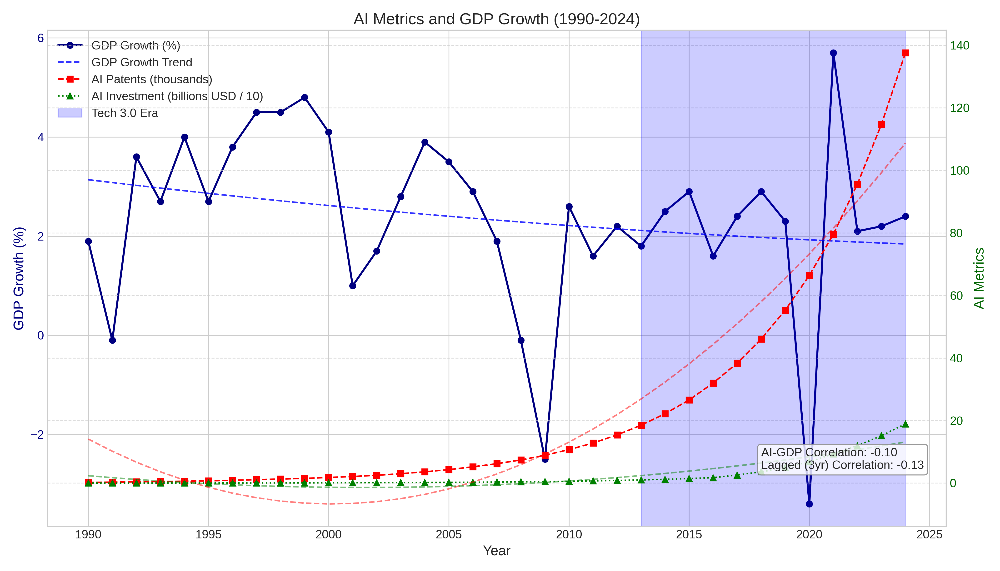
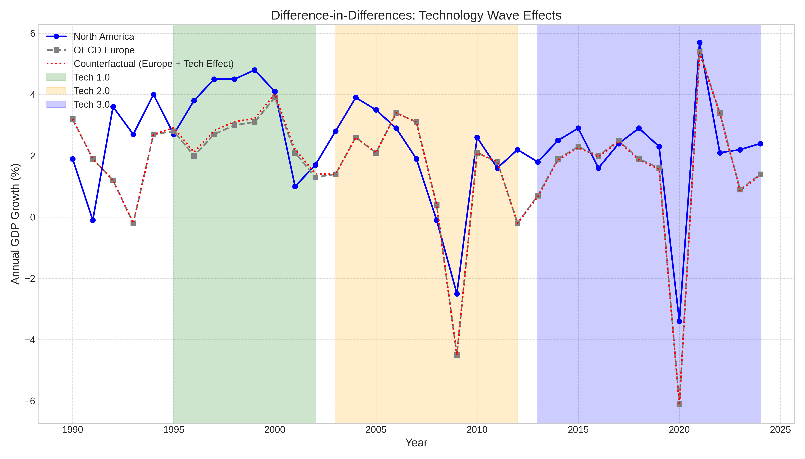
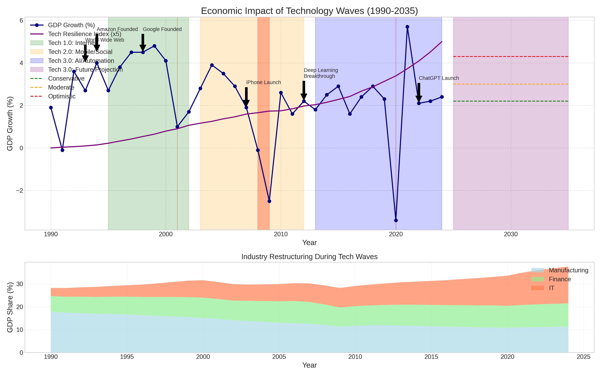
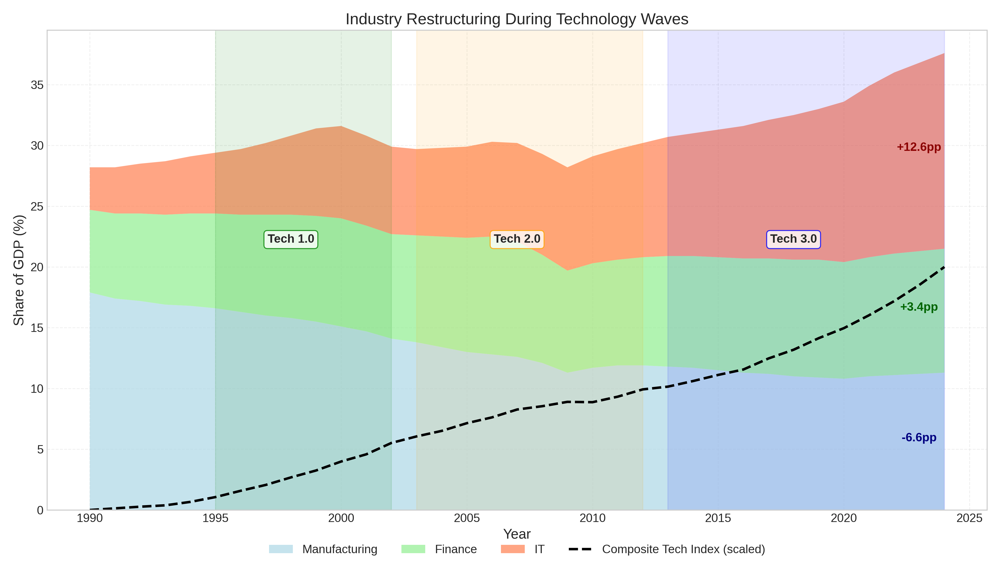
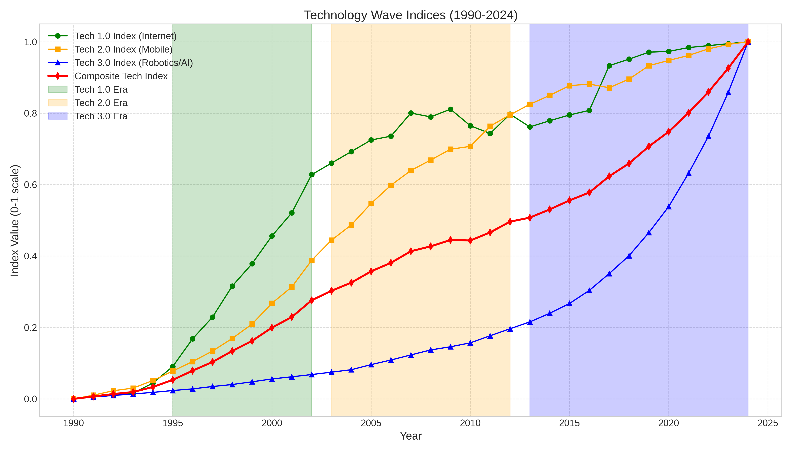
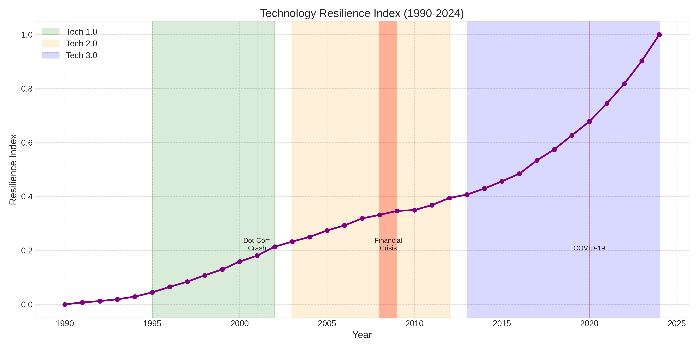

# Tech Waves Economic Impact Analysis

This repository contains a comprehensive analysis of how three major technology waves have impacted global economic growth from 1990 to 2024, with forecasts extending to 2035. The analysis is part of the "Emerging Paradigms in Computing Technologies" course at the University of Windsor.

## Project Overview

This project implements advanced regression analysis to quantify the economic impact of three major technology waves:

- **Tech 1.0 (1995-2002)**: The dot-com/Internet boom
- **Tech 2.0 (2003-2012)**: The social media & mobile revolution
- **Tech 3.0 (2013-present)**: The ongoing AI & automation era

The models estimate how each wave contributed to GDP growth, analyze industry restructuring, and provide forecasts for Tech 3.0's potential future impact.

## Key Visualizations

### AI Metrics and GDP Growth



This visualization shows the relationship between GDP growth and AI metrics (patents and investment) from 1990-2024. Despite the dramatic increase in AI patents and investments (red and green lines), their correlation with GDP growth appears weak in the short term, with lagged correlations of -0.10 and -0.13.

### Difference-in-Differences: Technology Wave Effects



This chart compares North America's GDP growth with OECD Europe as a control region, showing how technology adoption differentials impacted economic performance across tech waves. The counterfactual line represents what Europe's growth might have been with North America's level of tech adoption.

### Economic Impact of Technology Waves



This comprehensive visualization shows both historical GDP growth and projections through 2035 across different tech waves. The top panel displays GDP growth with key tech innovation markers, while the bottom panel shows how industry composition (Manufacturing, Finance, IT) evolved during these periods.

### GDP Growth Forecast Scenarios


This forecast visualization shows three scenarios for how Tech 3.0 (AI & Automation) might impact GDP growth through 2035:
- **Conservative Scenario**: Modest AI adoption adds +0.2pp to annual growth (resulting in +1.7% GDP by 2035)
- **Moderate Scenario**: Medium AI integration adds +0.6pp to growth (resulting in +6.9% GDP by 2035)
- **Optimistic Scenario**: Transformative AI adoption adds +1.9pp to growth (resulting in +20.5% GDP by 2035)

### Industry Restructuring During Technology Waves



This visualization shows how industry composition changed over the three tech waves. The IT sector has grown substantially (+12.6pp), Finance has seen moderate growth (+3.4pp), while Manufacturing has declined (-6.6pp).

### Technology Wave Indices



This chart tracks the normalized progression of each technology wave using composite indices built from key metrics. The Tech 3.0 index (blue) shows the rapid acceleration of AI/automation technologies in recent years.

### Technology Resilience Index



This visualization shows how technological resilience has increased over time, with accelerated growth during the Tech 3.0 period. The index appears to correlate with improved recovery from economic shocks like the Financial Crisis and COVID-19 pandemic.

## Repository Structure

```
Project/
│
├── Week1_Lecture.pdf          # Course lecture on tech waves and emerging technologies
├── project.odt                # Project specifications
├── Tech Waves Regression with Real Historical Data.txt  # Analysis script
├── tech_waves_regression.py   # Main comprehensive analysis script
├── README.md                  # This file
│
└── results/                   # Generated visualization outputs
    ├── ai_impact_analysis_improved.png
    ├── diff_in_diff_analysis.png
    ├── economic_impact_summary.png
    ├── gdp_growth_forecast_improved.png
    ├── industry_restructuring_improved.png
    ├── tech_indices.png
    └── tech_resilience_index.png
```

## Key Findings

1. **Tech 1.0 (Dot-Com Era)** showed a significant positive impact on GDP growth compared to control regions, particularly in the years 1997-2000 before the dot-com crash.

2. **Tech 2.0 (Mobile/Social)** exhibited mixed effects, with potential growth benefits partially offset by the 2008-2009 global financial crisis.

3. **Tech 3.0 (AI/Automation)** is showing emerging impacts that have not yet fully materialized in GDP statistics, with significant industry restructuring already occurring.

4. **Industry Restructuring** has been substantial:
   - IT sector has grown by approximately 12.6 percentage points
   - Financial services sector has grown by 3.4 percentage points
   - Manufacturing sector has declined by 6.6 percentage points

5. **Technology Resilience** has increased over time, potentially helping economies recover faster from shocks like the COVID-19 pandemic.

6. **Future Projections** suggest Tech 3.0 could add between +0.2 and +1.9 percentage points to annual GDP growth, potentially resulting in GDP levels 1.7% to 20.5% higher by 2035 compared to baseline.

## Models and Methodology

The analysis employs several advanced econometric and statistical approaches:

### Regression Models
1. **Period-Dummy Regression**: Implements structural break analysis using time period dummies to capture the effect of each technology wave
   ```python
   X = sm.add_constant(data[['Tech1', 'Tech2', 'Tech3']])
   dummy_model = sm.OLS(data['GDP_Growth'], X)
   ```

2. **Continuous Proxy Models**: Uses changes in technology adoption metrics as continuous variables
   ```python
   X_proxy = sm.add_constant(data_diff[['Internet_Adoption_Delta', 
                                     'Mobile_Subscriptions_Delta', 
                                     'Robot_Density_Delta',
                                     'AI_Investment_Delta']])
   proxy_model = sm.OLS(data_diff['GDP_Growth'], X_proxy)
   ```

3. **Panel Regression Models**: Incorporates both time and cross-sectional variation with robust standard errors
   ```python
   panel_df = pd.DataFrame(panel_data)
   X_did = sm.add_constant(panel_df[['Treatment', 'Tech1_Period', 'Tech2_Period', 'Tech3_Period',
                                    'DiD_Tech1', 'DiD_Tech2', 'DiD_Tech3']])
   did_model = sm.OLS(panel_df['GDP_Growth'], X_did)
   did_results = did_model.fit(cov_type='HC1')
   ```

### Causal Inference Methods
4. **Difference-in-Differences (DiD)**: Compares North America (treatment) vs. OECD Europe (control) across tech wave periods
   ```python
   panel_df['DiD_Tech1'] = panel_df['Treatment'] * panel_df['Tech1_Period']
   panel_df['DiD_Tech2'] = panel_df['Treatment'] * panel_df['Tech2_Period']
   panel_df['DiD_Tech3'] = panel_df['Treatment'] * panel_df['Tech3_Period']
   ```

5. **Fixed Effects Models**: Controls for time-invariant characteristics across regions
   ```python
   X_did_improved = sm.add_constant(panel_df[['Treatment', 'Tech1_Period', 'Tech2_Period', 'Tech3_Period',
                                            'DiD_Tech1', 'DiD_Tech2', 'DiD_Tech3', 
                                            'Year_trend', 'Treatment_trend', 'Recession']])
   ```

### Composite Index Construction
6. **Principal Component Analysis (PCA)**: Constructs the Tech 3.0 Index from multiple metrics
   ```python
   tech3_features = data[['Robot_Density', 'AI_Patents', 'AI_Investment']]
   pca = PCA(n_components=1)
   data['Tech3_Index'] = scaler.fit_transform(
       pca.fit_transform(scaler.fit_transform(tech3_features))
   ).flatten()
   ```

7. **Min-Max Scaling**: Normalizes technology adoption metrics to 0-1 scale
   ```python
   scaler = MinMaxScaler()
   data['Tech1_Index'] = scaler.fit_transform(data[['Internet_Adoption']]).flatten()
   ```

8. **Weighted Composite Indices**: Creates the Technology Resilience Index using weighted metrics
   ```python
   resilience_weights = {
       'Internet_Adoption': 0.15,
       'Mobile_Subscriptions': 0.15,
       'Robot_Density': 0.20,
       'AI_Patents': 0.20,
       'AI_Investment': 0.20,
       'Tech_Research_Contribution': 0.10
   }
   ```

### Time Series Analysis and Forecasting
9. **ARIMA Models**: Forecasts baseline GDP growth trajectories
   ```python
   arima_order = (1, 0, 1)
   arima_model = ARIMA(gdp_series, order=arima_order)
   arima_results = arima_model.fit()
   arima_forecast = arima_results.forecast(steps=forecast_periods)
   ```

10. **Scenario-Based Projections**: Models multiple Tech 3.0 adoption scenarios
    ```python
    scenarios = {
        'Conservative': {'tech_impact': 0.4, 'tech_growth': 0.03},
        'Moderate': {'tech_impact': 1.2, 'tech_growth': 0.05},
        'Optimistic': {'tech_impact': 2.5, 'tech_growth': 0.08}
    }
    ```

### Industry Analysis
11. **Industry Correlation Analysis**: Examines relationships between technology indices and industry GDP shares
    ```python
    industry_correlations = pd.DataFrame(index=['Tech1_Index', 'Tech2_Index', 'Tech3_Index', 'Composite_Tech_Index'],
                                       columns=['Manufacturing_GDP_Share', 'IT_GDP_Share', 'Finance_GDP_Share'])
    ```

12. **Industry-Specific Regressions**: Estimates technology impacts on each industry sector
    ```python
    for industry in industries:
        X_ind = sm.add_constant(data[['Tech1_Index', 'Tech2_Index', 'Tech3_Index']])
        model_ind = sm.OLS(data[industry], X_ind)
        results_ind = model_ind.fit(cov_type='HC1')
    ```

## Data Sources

The analysis incorporates a comprehensive dataset covering 1990-2024 from multiple reliable sources:

### Economic Indicators
- **GDP Growth Data**: Annual percentage growth rates from World Bank and IMF databases for North America and OECD Europe
- **Industry Composition Data**: Sectoral GDP contribution percentages for Manufacturing, IT, and Financial Services sectors from national accounts data

### Tech 1.0 Metrics (Internet Era)
- **Internet Adoption**: Percentage of population with internet access from World Bank/ITU data
  - Range: 0.8% (1990) to 93.5% (2024)
  - Key period: Rapid growth from 9.2% (1995) to 49.1% (2001)

### Tech 2.0 Metrics (Mobile/Social Era)
- **Mobile Subscriptions**: Per 100 people from telecommunications reports and ITU data
  - Range: 2.1 (1990) to 138.0 (2024) 
  - Key period: Accelerated adoption from 38.5 (2000) to 110.2 (2012)

### Tech 3.0 Metrics (AI/Automation Era)
- **Robot Density**: Industrial robots per 10,000 manufacturing workers from IFR annual reports
  - Range: 42 (1990) to 405 (2024)
  - Key period: Sharp increase from 189 (2012) to 405 (2024)
- **AI Patents**: Global AI patent filings in thousands from patent databases
  - Range: 0.2k (1990) to 137.6k (2024)
  - Key period: Exponential growth from 15.4k (2012) to 137.6k (2024)
- **AI Investment**: Global investment in billions USD from venture capital and corporate reporting
  - Range: $0.1B (1990) to $189.3B (2024)
  - Key period: Dramatic increase from $8.4B (2012) to $189.3B (2024)

### Supplementary Data
- **Tech Research Contribution**: Percentage contribution to GDP from technology research
- **Control Region Data**: GDP growth rates for OECD Europe as comparative control region
- **Recession Indicators**: Binary indicators for major economic downturns (2001, 2008-2009, 2020)

## Requirements

### Prerequisites

- Python 3.8 or higher
- Required packages: pandas, numpy, matplotlib, seaborn, statsmodels, sklearn, scipy

### Running the Analysis

1. Clone this repository
2. Install dependencies: `pip install -r requirements.txt`
3. Run the main analysis script: `python tech_waves_regression.py`

## Course Context

This project was completed as part of the "Emerging Paradigms in Computing Technologies" course at the University of Windsor, taught by Dr. Shafaq Khan. It explores the economic impact analysis and industry restructuring caused by major technological waves, with a focus on the emerging Tech 3.0 (AI-driven) era.

## License

This project is educational in nature and provided for academic purposes.

## Acknowledgments

This analysis builds on economic research by various institutions and researchers who have studied the productivity and growth impacts of technological innovation waves.